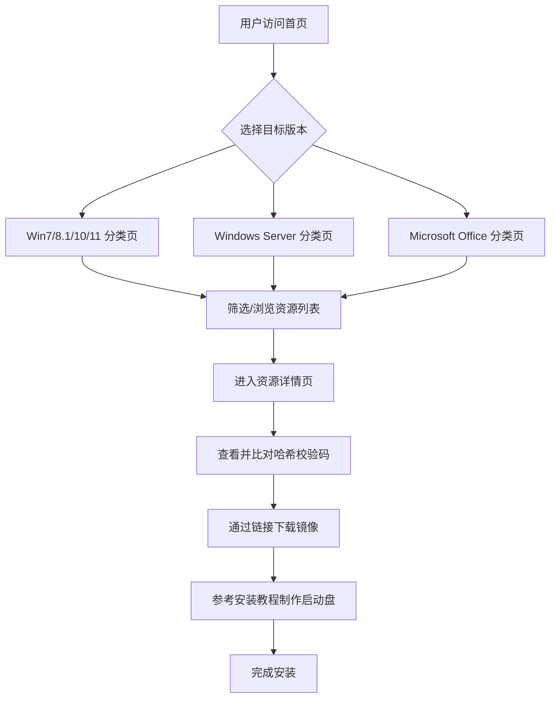

# 产品需求文档：WinOrigin — 第三方微软原版 Windows 镜像下载站

## 1. 产品概述

打造国内第三方的微软原版 Windows 镜像下载站，聚焦纯净无捆绑、哈希校验保障、安装指引三大核心价值。面向装机用户与 IT 从业者，提供从 Win7 到 Win11、Windows Server 及 Microsoft Office 的原版索引资源。

- **目标用户**：普通装机用户、系统管理员、IT 运维人员
- **核心价值**：纯净安全（不修改系统文件）、信息透明（完整校验码+来源标注）、一站式资源覆盖
- **差异化**：比官方站点更便捷的导航，比第三方站点更可信的校验体系

## 2. 核心功能

### 2.1 用户角色
| 角色 | 访问方式 | 核心权限 |
|------|----------|----------|
| 普通访客 | 无需注册 | 浏览所有资源、查看校验码、阅读安装教程 |
| 维护管理员 | 本地维护 | 通过数据脚本更新资源目录 |

### 2.2 功能模块
1. **首页信息面板**：系统分类导航、最新资源动态、安全下载指引
2. **版本分类目录**：按产品线组织资源树（Win7/Win8.1/Win10/Win11/Server/Office）
3. **资源详情页**：版本信息、校验码、下载链接、来源标注
4. **安装指南页**：启动盘制作教程、安全校验说明
5. **关于/声明页**：项目说明、免责声明

### 2.3 页面详情
| 页面名称 | 模块名称 | 功能描述 |
|----------|----------|----------|
| 首页 | 顶部导航栏 | 品牌Logo + 分类导航链接（Win7/Win8.1/Win10/Win11/Server/Office/教程） |
| 首页 | 英雄区域 | 科技感大背景 + 标语 + 快速入口卡片 |
| 首页 | 资源概览 | 各版本最新资源卡片展示（版本号+语言+架构） |
| 首页 | 安全提示 | 校验流程说明 + 防伪提醒 |
| 首页 | 底部 | 版权声明 + 友情链接 + 免责声明 |
| 分类页 | 筛选栏 | 按版本/语言/架构/位宽过滤 |
| 分类页 | 资源列表 | 表格展示：版本名称、版本号、发布日期、语言、架构 |
| 详情页 | 版本信息 | 完整版本号、SKU、架构、语言 |
| 详情页 | 校验信息 | SHA-1/SHA-256 校验码、原版签名信息 |
| 详情页 | 下载链接 | 各来源下载地址、文件大小 |
| 详情页 | 来源标注 | 数据来源网站链接标注 |
| 教程页 | 教程列表 | 安装启动盘制作、校验工具使用等 |

## 3. 核心流程

用户在首页浏览各版本分类，点击后进入分类页查看资源列表，筛选定位目标版本后点击进入详情页，获取校验码并验证后通过下载链接获取镜像，最后参考安装教程完成系统安装。

## 4. 用户界面设计

### 4.1 设计风格

- **整体风格**：深色科技感主题，以深蓝/黑为主色调，搭配青色/蓝色渐变作为强调色
- **主色调**：`#0a0e1a`（深空背景）、`#1a1f35`（卡片背景）
- **强调色**：`#00d4ff`（科技蓝）、`#7c3aed`（紫色渐变）
- **按钮风格**：圆角较小（4px），有微光效和悬浮动效
- **字体方案**：
  - 标题：`"JetBrains Mono"` 或 `"Sarasa Mono SC"`（等宽字体，突出技术感）
  - 正文：`"Noto Sans SC"` + `"Microsoft YaHei"` 后备
- **布局风格**：顶部固定导航 + 左右不对称网格布局，卡片式内容展示
- **图标风格**：使用 Font Awesome 或自建 SVG 图标，强调线条感和科技感

### 4.2 页面设计概览
| 页面名称 | 模块名称 | UI 元素 |
|----------|----------|---------|
| 首页 | 英雄区域 | 全屏动态粒子/网格背景、大号渐变标题、发光按钮、快速入口卡片网格 |
| 首页 | 资源概览 | 毛玻璃效果卡片、版本号徽标、渐变边框 |
| 分类页 | 资源列表 | 粘性筛选栏、表格行悬浮高亮、分页导航 |
| 详情页 | 信息卡片 | 代码块样式校验码（带一键复制）、标签式信息展示 |
| 教程页 | 步骤指导 | 编号步骤卡片、代码块命令、警告提示框 |

### 4.3 响应式设计
- 优先桌面端体验（1200px+ 宽屏优化）
- 平板端（768px-1199px）保持卡片网格自适应
- 移动端（<768px）导航折叠为汉堡菜单，表格改为列表展示

## 5. 数据来源与更新

- **数据来源**：
  - HelloWindows：`https://hellowindows.cn/`
  - 系统库：`https://www.xitongku.com/`
  - 山己几子木：`https://msdn.sjjzm.com/`
- **同步方式**：通过 Python 抓取脚本定期爬取各站最新版本信息
- **数据格式**：JSON 格式存储于 `data/` 目录下，供静态页面读取
- **更新频率**：建议每周自动同步一次
