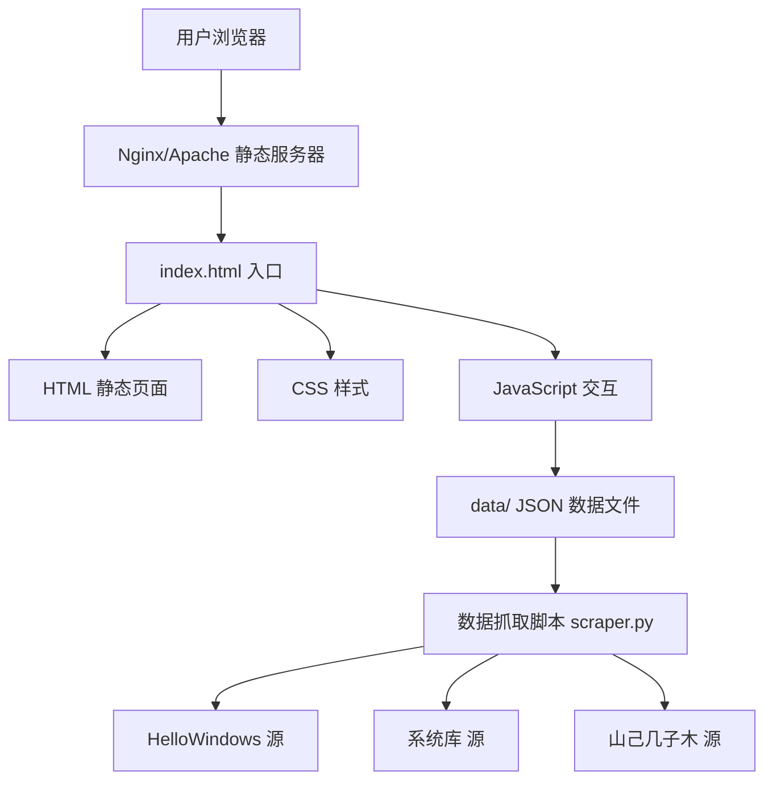

# 技术架构文档：WinOrigin 镜像下载站

## 1. 架构设计



## 2. 技术选型

| 层级 | 技术 | 说明 |
|------|------|------|
| 前端框架 | 原生 HTML + CSS + JavaScript | 纯静态站点，无需构建工具链 |
| CSS 方案 | 手写 CSS + CSS 变量 + 毛玻璃效果 | 独立文件，按模块拆分 |
| 交互效果 | 原生 JS + CSS Animations/Transitions | 粒子背景使用 Canvas API |
| 图标方案 | Font Awesome 6 (CDN) | 科技感线条图标 |
| 字体方案 | Google Fonts: JetBrains Mono + Noto Sans SC | CDN 引入 |
| 数据格式 | JSON 文件 | 存放于 `data/` 目录 |
| 数据抓取 | Python 3 + requests + BeautifulSoup4 | 独立脚本 |
| 部署方案 | Nginx / GitHub Pages / Cloudflare Pages | 零后端静态托管 |

## 3. 项目目录结构

```
winorigin/
├── index.html              # 首页入口
├── pages/
│   ├── win7.html           # Win7 分类页
│   ├── win8.html           # Win8.1 分类页
│   ├── win10.html          # Win10 分类页
│   ├── win11.html          # Win11 分类页
│   ├── server.html         # Windows Server 分类页
│   ├── office.html         # Microsoft Office 分类页
│   ├── detail.html         # 资源详情页（通用模板）
│   └── guide.html          # 安装教程页
├── css/
│   ├── style.css           # 全局样式 + CSS 变量
│   ├── home.css            # 首页专用样式
│   ├── category.css        # 分类页专用样式
│   ├── detail.css          # 详情页专用样式
│   └── guide.css           # 教程页专用样式
├── js/
│   ├── main.js             # 全局交互（导航、主题、动画）
│   ├── home.js             # 首页粒子背景 + 卡片加载
│   ├── category.js         # 分类页筛选 + 列表渲染
│   ├── detail.js           # 详情页校验码复制 + 数据加载
│   └── guide.js            # 教程页交互
├── data/
│   ├── win11.json          # Win11 版本数据
│   ├── win10.json          # Win10 版本数据
│   ├── win81.json          # Win8.1 版本数据
│   ├── win7.json           # Win7 版本数据
│   ├── server.json         # Server 版本数据
│   └── office.json         # Office 版本数据
├── scripts/
│   └── scraper.py          # Python 数据抓取脚本
└── assets/
    └── favicon.ico         # 站点图标
```

## 4. 路由定义
| 路径 | 页面 | 说明 |
|------|------|------|
| `/` | 首页 | 站点入口，英雄区 + 资源概览 |
| `/win7.html` | Win7 分类 | Windows 7 各版本资源 |
| `/win8.html` | Win8.1 分类 | Windows 8.1 各版本资源 |
| `/win10.html` | Win10 分类 | Windows 10 各版本资源 |
| `/win11.html` | Win11 分类 | Windows 11 各版本资源 |
| `/server.html` | Server 分类 | Windows Server 各版本资源 |
| `/office.html` | Office 分类 | Microsoft Office 各版本资源 |
| `/detail.html?id=xxx` | 资源详情 | 通过 URL 参数加载资源详情（由 JS 解析） |
| `/guide.html` | 安装教程 | 启动盘制作 + 校验说明 |

## 5. 数据模型

### 5.1 JSON 数据结构
```json
{
  "products": [
    {
      "id": "win11-23h2-zh-cn-pro",
      "name": "Windows 11 专业版",
      "version": "23H2",
      "build": "22631.2861",
      "releaseDate": "2024-02-13",
      "language": "zh-cn",
      "architecture": "x64",
      "edition": "Professional",
      "sku": "Professional",
      "fileSize": "6.4GB",
      "hashes": {
        "sha1": "E7C7E1C5E5C7E7C7E7C7E7C7E7C7E7C7E7C7E7C7",
        "sha256": "A7C7E1C5E5C7E7C7E7C7E7C7E7C7E7C7E7C7E7C7E7C7E7C7E7C7E7C7E7"
      },
      "sources": [
        {
          "name": "HelloWindows",
          "url": "https://hellowindows.cn/download/xxx",
          "type": "direct"
        },
        {
          "name": "系统库",
          "url": "https://www.xitongku.com/download/xxx",
          "type": "direct"
        }
      ],
      "originalSource": "Microsoft MSDN",
      "verified": true
    }
  ]
}
```

### 5.2 分类定义
| 分类 | 包含版本 | 备注 |
|------|----------|------|
| win11 | 家庭版/专业版/企业版/LTSC | 24H2, 23H2, 22H2 |
| win10 | 家庭版/专业版/企业版/LTSC/LTSB | 22H2 及以下 |
| win81 | 核心版/专业版/企业版 | 含 Update |
| win7 | 家庭普通版/家庭高级版/专业版/旗舰版 | 含 SP1 |
| server | 2016/2019/2022 Datacenter/Standard | 含 Essentials |
| office | 2016/2019/2021/2024 | 专业增强版/标准版 |

## 6. 数据抓取策略

### 6.1 抓取脚本设计
- **语言**：Python 3.10+
- **核心依赖**：requests, beautifulsoup4, lxml
- **运行方式**：`python scripts/scraper.py`
- **输出**：更新 `data/` 目录下对应的 JSON 文件

### 6.2 抓取来源配置
| 来源 | 目标内容 | 更新策略 |
|------|----------|----------|
| hellowindows.cn | 各版本下载链接 + 校验码 | 增量更新 |
| xitongku.com | 版本信息、下载链接 | 全量更新 |
| msdn.sjjzm.com | 原始 MSDN 信息、校验和 | 增量更新 |

## 7. 性能优化

- **页面大小**：每个 HTML 控制在 50KB 以内（不含外部资源）
- **图片优化**：使用 WebP 格式（如有），或纯 CSS 视觉替代
- **CDN 引用**：Font Awesome 和 Google Fonts 使用 CDN
- **按需加载**：详情页数据通过 JS 按需加载对应 JSON
- **缓存策略**：JSON 数据文件设置较长的 Cache-Control
