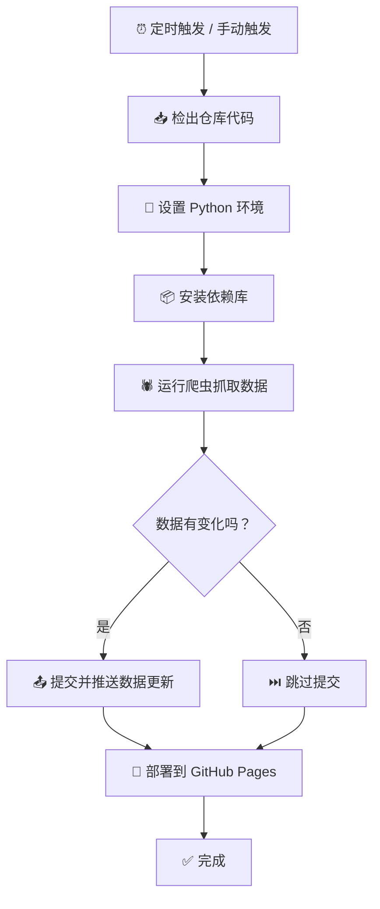

<div align="center">

# 🏛️ SCM Pavilion

### 海云典藏镜像 · 第三方微软原版系统镜像索引站

<br/>

[](LICENSE)
[](https://www.python.org/)
[](https://github.com/features/actions)
[](https://pages.github.com/)
[]()

[]()
[]()
[]()

---


**纯净原版 · 安全无捆绑 · SHA-1 / SHA-256 校验可查**

聚合整理 **Windows 7 ~ Windows 11**、**Windows Server** 及 **Microsoft Office** 全版本原版镜像资源

**[🌐 立即访问](https://sdlw7757.github.io/SCM-Pavilion)**
·
**[📖 安装指南](pages/guide.html)**
·
**[🐛 反馈问题](https://github.com/sdlw7757/SCM-Pavilion/issues)**
· 
**[演示](https://sdlw7757.github.io/SCM-Pavilion/ "演示站点")**
· 
**[海云典藏镜像，装机安心之选](https://517757.xyz/ "官方站点")**

<br/>
</div>

---

<details open>
<summary><strong>📋 目录</strong></summary>

- [项目简介](#-项目简介)
- [功能特性](#-功能特性)
- [收录版本一览](#-收录版本一览)
- [数据来源](#-数据来源)
- [快速开始](#-快速开始)
- [部署到 GitHub Pages](#-部署到-github-pages)
- [技术栈](#-技术栈)
- [项目文件结构](#-项目文件结构)
- [扩展指南：添加新版本](#-扩展指南添加新版本)
- [自动化工作流说明](#-自动化工作流说明)
- [本地开发指南](#-本地开发指南)
- [常见问题 FAQ](#-常见问题-faq)
- [免责声明](#-免责声明)
- [许可证](#-许可证)

</details>

---


## 📖 项目简介

**SCM Pavilion（海云典藏镜像）** 是一个面向装机用户和系统爱好者的**第三方微软原版镜像索引站**。

### 为什么需要这个项目？

当你想重装系统时，经常遇到这些困扰：

> 🔴 网上找的镜像捆绑了第三方软件，不放心  
> 🔴 微软官方下载速度慢，且需要正版密钥  
> 🔴 多个网盘链接散落在不同页面，查找麻烦  
> 🔴 下载后不知道文件是否被修改过

**SCM Pavilion 一站式解决了这些问题：**

- ✅ 从多个可信来源聚合下载链接，每个来源都提供**原版未修改**的镜像
- ✅ 提供阿里云盘、百度网盘、天翼云盘等**国内高速下载通道**
- ✅ 每个文件附带 **SHA-1 / SHA-256 校验码**，下载后可自行验证完整性
- ✅ 自动跟踪各版本的最新**累积更新补丁号**和 **Build 号**

### 设计理念

> **「只做索引，不存文件」**

本站仅整理和展示下载链接及校验信息，**不存储任何镜像文件**。所有下载链接均指向第三方网站，确保项目合法合规。

---

## 🎯 功能特性

<div align="center">

| 特性 | 说明 |
|:---|:---|
| 🌐 **多源聚合** | 自动合并 HelloWindows、山己几子木、系统库 三个数据源的同产品信息 |
| 📥 **七种下载方式** | 阿里云盘 · 百度网盘 · 天翼云盘 · 腾讯微云 · 移动云盘 · ed2k · BT 磁力链接 |
| 🔐 **双重校验** | 每个文件同时提供 **SHA-1** 和 **SHA-256** 校验码，确保原版未改 |
| 🏷️ **版本追踪** | 实时显示各 Windows 版本的**最新补丁号**和**内部 Build 号** |
| 🚫 **已停止服务标记** | 微软已停止支持的版本（如 Win10 1511~21H2）自动标记 |
| 📱 **全端适配** | 响应式设计，手机/平板/桌面均获得最佳浏览体验 |
| ⚡ **自动更新** | 每天**北京时间 14:00** 定时抓取最新数据 |
| 🆓 **零成本部署** | 纯静态网站，GitHub Pages 免费托管，无服务器费用 |

</div>

---

## 📋 收录版本一览

### Windows 操作系统

| 系统 | 收录版本 | Business 版 | Consumer 版 | x64 | arm64 |
|:---|:---|:---:|:---:|:---:|:---:|
| **Windows 11** | 26H1 · 25H2 · 24H2 · 23H2 · 22H2 · 21H2 · LTSC 2024 | ✅ | ✅ | ✅ | ✅ |
| **Windows 10** | 22H2 · 21H2 · 21H1 · 20H2 · 2004 · 1909 · 1903 · 1809 · 1803 · 1709 · 1703 · 1607 · 1511 · LTSC 2021 | ✅ | ✅ | ✅ | — |
| **Windows 8.1** | Update 3（x86 / x64） | ✅ | ✅ | ✅ | — |
| **Windows 7** | SP1（x86 / x64） | — | — | ✅ | — |
| **Windows Server** | 2008 R2 · 2012 · 2012 R2 · 2016 · 2019 · 2022 · 2025 | ✅ | — | ✅ | — |

> ℹ️ **Business（商业版）** 包含：Education · Enterprise · Professional  
> ℹ️ **Consumer（消费者版）** 包含：Home · Education · Enterprise · Professional  
> ℹ️ 每个版本均提供**完整版文件**和**详细校验码**

### Microsoft Office

| 产品线 | 收录版本 | 说明 |
|:---|:---|:---|
| **Office 零售版** | 2016 · 2019 · 2021 · 2024 | 适用于个人和家庭用户 |
| **Office 批量授权版** | LTSC 2021 · LTSC 2024 | 适用于企业和组织 |
| **Microsoft 365** | Office 365 | 订阅制服务 |

---

## 🔗 数据来源

本项目自动从以下三个数据源抓取数据，并按产品 ID 进行**智能合并**：

### 数据源对比

| 数据源 | 网址 | 数据内容 | 更新频率 | 可靠性 |
|:---|:---|:---|:---:|:---:|
| **HelloWindows**  | [hellowindows.cn](https://hellowindows.cn/) | 文件名、版本、语言、SHA-1、SHA-256、文件大小、发布日期 | 及时 | ⭐⭐⭐⭐⭐ |
| **山己几子木**  | [msdn.sjjzm.com](https://msdn.sjjzm.com/) | 阿里云盘、腾讯微云、百度网盘、天翼云盘、移动云盘、ed2k、BT 磁力链接 | 及时 | ⭐⭐⭐⭐⭐ |
| **系统库**  | [xitongku.com](https://xitongku.com/) | 最新累积更新补丁号、内部 Build 号、服务状态 | 及时 | ⭐⭐⭐⭐⭐ |

### 合并策略

```
产品 A（ID: win-xxxxx）
│
├── 元信息 → HelloWindows（文件名、大小、校验码）
├── 下载链接 → 山己几子木（网盘、ed2k、磁力）
└── 版本追踪 → 系统库（补丁号、Build 号）
```

---

## 🚀 快速开始

### 环境要求

- **Python 3.11** 或更高版本
- **pip** 包管理工具
- 网络连接（用于抓取数据）

### 第一步：获取项目

```bash
git clone https://github.com/sdlw7757/SCM-Pavilion.git
cd SCM-Pavilion
```

### 第二步：安装依赖

```bash
pip install -r requirements.txt
```

### 第三步：运行爬虫生成数据

```bash
python scripts/scraper.py
```

执行成功后，你将在 `data/` 目录下看到以下文件：

```
data/
├── meta.json          # 元数据：统计信息 + 版本追踪
├── win11.json         # Windows 11 产品数据
├── win10.json         # Windows 10 产品数据
├── win81.json         # Windows 8.1 产品数据
├── win7.json          # Windows 7 产品数据
├── server.json        # Windows Server 产品数据
└── office.json        # Microsoft Office 产品数据
```

### 第四步：本地预览

```bash
# 方式一：Python 自带 HTTP 服务器
python -m http.server 8000

# 方式二：使用 VS Code Live Server 插件（推荐，支持热重载）
```

打开浏览器访问 👉 **[http://localhost:8000](http://localhost:8000)**

---

## 🚀 部署

> ⏱️ 支持 GitHub Pages 和 Cloudflare Pages 双平台部署

### GitHub Pages 部署

### 第 1 步 — 创建 GitHub 仓库

登录 GitHub，点击右上角 **+** → **New repository**，输入仓库名，选择 **Public**。

### 第 2 步 — 推送代码

```bash
# 初始化本地仓库
git init
git add .
git commit -m "🎉 Initial commit: SCM Pavilion 海云典藏镜像"

# 重命名主分支为 main
git branch -M main

# 关联远程仓库（替换为你的仓库地址）
git remote add origin https://github.com/你的用户名/仓库名.git

# 推送到 GitHub
git push -u origin main
```

### 第 3 步 — 开启 Pages 并授予权限

| 步骤 | 操作路径 | 设置项 |
|:---|:---|:---|
| ① | 仓库 → **Settings** → **Pages** | **Source** → 选择 **GitHub Actions** |
| ② | 仓库 → **Settings** → **Actions** → **General** | **Workflow permissions** → 勾选 **Read and write permissions** |

### 第 4 步 — 手动触发首次部署

> 仓库 → **Actions** → 选择 **抓取数据并部署** → 点击 **Run workflow**

### ⏰ 自动更新计划

配置完成后，工作流将按以下时间自动运行：

| 时区 | 运行时间 | 说明 |
|:---|:---|:---|
| **UTC** | 06:00 | 国际标准时间 |
| **北京时间** | **14:00** | 每天下午两点自动更新 |
| **美东时间** | 01:00（冬令时）/ 02:00（夏令时） | — |

> 💡 自动运行无需任何人干预，你只需保持仓库存在即可。

### Cloudflare Pages 部署

| 步骤 | 操作 |
|:---|:---|
| ① | 登录 [Cloudflare Dashboard](https://dash.cloudflare.com/) → **Pages** → **创建应用程序** |
| ② | 连接 GitHub → 选择 `sdlw7757/SCM-Pavilion` 仓库 |
| ③ | 构建命令：**留空**，构建输出目录：`/` |
| ④ | 点击 **保存并部署** |

> 💡 Cloudflare Pages 检测到 GitHub 仓库推送后会自动重新部署，无需额外配置。

---

## 🛠️ 技术栈

<div align="center">

| 层级 | 技术选型 | 用途说明 |
|:---|:---|:---|
| 🌐 **前端** | HTML5 · CSS3 · JavaScript (ES6+) | 网站界面与交互逻辑 |
| 🎨 **图标** | [Font Awesome 6](https://fontawesome.com/) | 导航栏、按钮、功能标识图标 |
| 🔤 **字体** | JetBrains Mono · Noto Sans SC | 代码显示 + 中文字体优化 |
| 🐍 **爬虫** | Python 3.11 | 多源数据抓取与合并 |
| 📦 **依赖库** | requests · BeautifulSoup4 · lxml | HTTP 请求 · HTML 解析 · 高效解析 |
| 🤖 **CI/CD** | [GitHub Actions](https://github.com/features/actions) | 定时触发、自动部署 |
| 🌩️ **托管** | [GitHub Pages](https://pages.github.com/) | 免费静态网站托管 |
| 📊 **数据** | JSON | 纯静态数据文件，无数据库依赖 |

</div>

---

## 📁 项目文件结构

```
SCM-Pavilion/
│
├── index.html                      # 🏠 首页
│
├── pages/                          # 📄 页面目录
│   ├── win11.html                  #   Windows 11 分类页
│   ├── win10.html                  #   Windows 10 分类页
│   ├── win7.html                   #   Windows 7 分类页
│   ├── win8.html                   #   Windows 8.1 分类页
│   ├── server.html                 #   Windows Server 分类页
│   ├── office.html                 #   Office 分类页
│   ├── detail.html                 #   产品详情页（核心页面）
│   └── guide.html                  #   安装教程页
│
├── js/                             # ⚡ JavaScript 目录
│   ├── main.js                     #   公共逻辑：数据加载、导航
│   ├── home.js                     #   首页渲染：统计、最新版本
│   ├── category.js                 #   分类页渲染：列表、筛选、补丁
│   ├── detail.js                   #   详情页渲染：链接、校验、版本
│   └── guide.js                    #   教程页交互逻辑
│
├── css/                            # 🎨 样式目录
│   ├── style.css                   #   全局样式（导航、页脚、按钮）
│   ├── home.css                    #   首页专属样式（Hero、统计卡片）
│   ├── category.css                #   分类页专属样式（表格、筛选栏）
│   ├── detail.css                  #   详情页专属样式（链接卡片、校验）
│   └── guide.css                   #   教程页样式
│
├── data/                           # 📊 JSON 数据（由爬虫自动生成）
│   ├── meta.json                   #   元数据：统计 + 版本追踪
│   ├── win11.json                  #   Windows 11 数据
│   ├── win10.json                  #   Windows 10 数据
│   ├── win81.json                  #   Windows 8.1 数据
│   ├── win7.json                   #   Windows 7 数据
│   ├── server.json                 #   Windows Server 数据
│   └── office.json                 #   Office 数据
│
├── scripts/                        # 🐍 Python 脚本目录
│   └── scraper.py                  #   全量数据抓取脚本（核心）
│
├── .github/workflows/              # 🤖 GitHub Actions 配置
│   └── scrape-and-deploy.yml       #   自动抓取 + 部署工作流
│
├── assets/                         # 🖼️ 静态资源
│   └── favicon.ico                 #   网站图标
│
├── .gitignore                      # Git 忽略规则
├── README.md                       # 📖 项目文档（本文件）
└── LICENSE                         # 📜 许可证文件
```

---

## 🔧 扩展指南：添加新版本

当微软发布新的 Windows 版本时，只需更新爬虫脚本中的版本追踪数据表即可。

### 步骤 1：编辑 `scripts/scraper.py`

找到文件中的 `TRACKING_DB` 字典（Python 代码）：

```python
# 版本追踪数据表
# 格式: (系统标识, 版本名): (Build号, 状态标记, 预留字段)
# 状态标记: '' = 正常, '已停止服务' = 微软已停止支持
TRACKING_DB = {
    # 添加新版本示例
    ('windows_11', '27h1'): (29000, '', ''),

    # 现有版本保持不变
    ('windows_11', '26h1'):  (28000, '', ''),
    ('windows_11', '25h2'):  (26100, '', ''),
    ('windows_11', '24h2'):  (26100, '', ''),
    ('windows_11', '23h2'):  (22631, '', ''),
    ('windows_11', '22h2'):  (22621, '', ''),
    ('windows_11', '21h2'):  (22000, '', ''),

    ('windows_10', '22h2'):  (19045, '', ''),
    ('windows_10', '21h2'):  (19044, '已停止服务', ''),
    ('windows_10', '21h1'):  (19043, '已停止服务', ''),
    # ... 更多版本
}
```

### 步骤 2：添加新版本对应的产品数据

如果你添加了一个全新的版本（例如 Windows 11 27H1），还需要确保三个数据源中有该版本的产品数据。如果有且爬虫能正确抓取，下次自动运行时就会自动包含。

### 步骤 3：等待自动更新

- 手动运行爬虫：`python scripts/scraper.py`
- 或等待当天 **14:00** 的自动抓取

> 💡 **前端无需修改** — 所有页面都是动态从 JSON 数据渲染的，新版本会自动出现在分类页中。

---

## 🤖 自动化工作流说明

本项目通过 GitHub Actions 实现**数据抓取 + 提交 + 部署**的全流程自动化。

### 工作流配置

配置位于 [`.github/workflows/scrape-and-deploy.yml`](.github/workflows/scrape-and-deploy.yml)：

```yaml
name: 抓取数据并部署

on:
  schedule:
    - cron: '0 6 * * *'   # 每天 UTC 6:00（北京时间 14:00）
  workflow_dispatch:        # 支持手动触发

jobs:
  scrape-and-deploy:
    runs-on: ubuntu-latest
    steps:
      - name: 检出仓库
        uses: actions/checkout@v4

      - name: 设置 Python
        uses: actions/setup-python@v5
        with:
          python-version: '3.11'
          cache: 'pip'

      - name: 安装依赖
        run: pip install requests beautifulsoup4 lxml

      - name: 运行数据抓取脚本
        run: python scripts/scraper.py

      - name: 提交并推送数据更新
        run: |
          git config user.name "winorigin-bot"
          git config user.email "bot@winorigin.github.io"
          git add data/
          git diff --cached --quiet || git commit -m "bot: 自动抓取更新 $(date +'%Y-%m-%d %H:%M') [skip ci]"
          git push

      - name: 设置 Pages
        uses: actions/configure-pages@v4

      - name: 上传站点文件
        uses: actions/upload-pages-artifact@v3
        with:
          path: '.'

      - name: 部署到 GitHub Pages
        uses: actions/deploy-pages@v4
```

### 工作流执行流程



### 状态查看

在 GitHub 仓库页面：

| 路径 | 可查看 |
|:---|:---|
| **Actions** 标签 | 每次运行的日志和状态 |
| **Settings → Pages** | 部署状态、访问地址 |

---

## 💻 本地开发指南

### 调试爬虫

```bash
# 仅抓取某个版本的数据（快速测试）
python -c "
import requests, re, json

# 测试 HelloWindows API
r = requests.get('https://hellowindows.cn/api/products?category=win11')
print(f'HelloWindows API 状态码: {r.status_code}')
print(f'产品数量: {len(r.json())}')
"

# 测试山己几子木页面解析
python -c "
import requests, re
r = requests.get('https://msdn.sjjzm.com/win11/26h1.html')
print(f'山己几子木页面大小: {len(r.text)} bytes')
# 检查产品数量
tables = re.findall(r'<table', r.text)
print(f'HTML 表格数量: {len(tables)}')
"
```

### 调试样式

```bash
# 使用 VS Code Live Server 热重载样式
# 或使用浏览器开发者工具直接编辑 CSS
```

### 数据验证

```bash
# 检查 JSON 数据完整性
python -c "
import json, os
data_dir = 'data'
for f in os.listdir(data_dir):
    if f.endswith('.json'):
        with open(os.path.join(data_dir, f)) as fh:
            data = json.load(fh)
        if isinstance(data, dict) and 'products' in data:
            print(f'✅ {f}: {len(data[\"products\"])} 个产品')
        else:
            print(f'✅ {f}: 元数据文件')
"
```

---

## ❓ 常见问题 FAQ

### Q1：网站上的下载链接安全吗？

> 所有下载链接均来自 **HelloWindows** 和 **山己几子木** 这两个经过验证的可信数据源。每个文件都提供了 **SHA-1** 和 **SHA-256** 校验码，你可以与微软官方公布的校验码进行比对，确保文件未被篡改。

### Q2：为什么有些产品没有下载链接？

> 不同数据源的覆盖范围不同。某些历史版本（如 Windows 10 1511）可能只在部分网站有存档。项目会尽力聚合所有来源的数据，但无法保证每个产品都有完整体验。

### Q3：数据多久更新一次？

> **每天北京时间 14:00**（UTC 6:00）自动更新一次。你也可以在 GitHub Actions 页面手动触发更新。

### Q4：我可以在自己的服务器上部署吗？

> 当然可以。这是一个纯静态网站，将整个项目上传到任何 **HTTP 服务器**（Nginx、Apache、Vercel、Netlify 等）即可运行。

### Q5：如何贡献或反馈问题？

> 请在 GitHub 仓库提交 [Issue](https://github.com/你的用户名/仓库名/issues) 或 Pull Request。

### Q6：遇到控制台 `404 /@vite/client` 错误？

> 这是浏览器的 **Vite** 插件注入的请求，可以忽略，不影响网站功能。

---

## ⚠️ 免责声明

```
╔══════════════════════════════════════════════════════════════╗
║                                                              ║
║  本项目为第三方资源索引站，仅用于学习和研究目的。               ║
║                                                              ║
║  1. 本站不存储、不托管、不提供任何受版权保护的文件。           ║
║  2. 所有镜像资源的版权归属 Microsoft Corporation（微软公司）。  ║
║  3. 下载链接来自公开的第三方网站（HelloWindows、山己几子木、   ║
║     系统库），本站仅做整理与索引。                            ║
║  4. 请于下载后 24 小时内删除，如需长期使用请购买正版授权。    ║
║  5. 使用者应对下载的文件自行承担法律和安全责任。              ║
║                                                              ║
╚══════════════════════════════════════════════════════════════╝
```

---

## 📜 许可证

本项目采用 **MIT License** 开源许可证。

```
MIT License

Copyright (c) 2024 SCM Pavilion

Permission is hereby granted, free of charge, to any person obtaining a copy
of this software and associated documentation files (the "Software"), to deal
in the Software without restriction, including without limitation the rights
to use, copy, modify, merge, publish, distribute, sublicense, and/or sell
copies of the Software, and to permit persons to whom the Software is
furnished to do so, subject to the following conditions:
...
```

详细信息请参阅项目根目录的 [LICENSE](LICENSE) 文件。

---

<div align="center">

<br/>

**SCM Pavilion · SeaCloud Mirror Pavilion** · 海云典藏镜像 · 装机安心之选

[](https://github.com/你的用户名/仓库名)
[](https://github.com/你的用户名/仓库名/fork)

<sub>如果这个项目对你有帮助，欢迎 ⭐ Star 支持！</sub>

</div>
